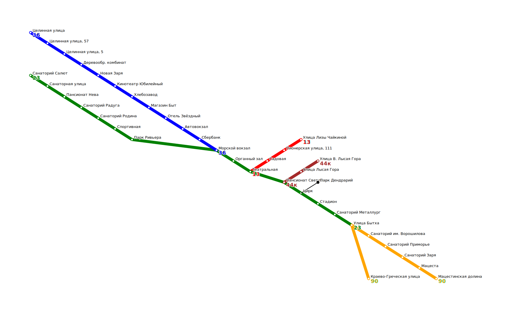

<h1><i> Transport Catalogue</i></h1>

## **Overview**

This is educational project completed during the course of training at Yandex Practicum.

Transport Catalogue - a system for storing and displaying information about bus routes, which implements:
* Processing requests and outputting results in JSON format
* Graphical output in SVG format
_____
______
## **Description**
The program receives a json file as input containing requests for filling the Transport Catalogue database (*base requests*) and requests for information from the database (*stat requests*). Top level structure of json file:
```
{
  "base_requests": [ ... ],
  "stat_requests": [ ... ]
} 
```
_____ 
### **Base requests**
The base requests array contains two types of elements: routes and stops. They are listed in random order.

### *Stop description example:*
```
{
  "type": "Stop",
  "name": "Elektrosety",
  "latitude": 43.598701,
  "longitude": 39.730623,
  "road_distances": {
    "Dokuchaeva street": 3000,
    "Likhobory": 4300
  }
} 
```
Here:
* *"type"* is a string equal to "Stop". Means that the dictionary describes the stop;
* *"name"* - stop name;
* *"latitude"* and *"longitude"* - coordinates of the stop (floating point numbers);
* *"road_distances"* - a dictionary that specifies the road distance from this stop to neighboring ones. Each key in this dictionary is the name of a neighboring stop, the value is an integer distance in meters.

### *Bus description example:*
```
{
  "type": "Bus",
  "name": "14",
  "stops": [
    "Likhobory",
    "Elektrosety",
    "Dokuchaeva street",
    "Likhobory"
  ],
  "is_roundtrip": true
} 
```
Here:
* *"type"* is the string "Bus". Means that the dictionary describes a bus route;
* *"name"* - route name;
* *"stops"* is an array with the names of the stops the route passes through. At the ring route, the name of the last stop duplicates the name of the first. For example: ["stop1", "stop2", "stop3", "stop1"];
* *"is_roundtrip"* is a bool value. true if the route is circular.
_____ 
### **Stat requests**
Requests are stored in the stat_requests array. In response to them, the program should output a json array of responses to stdout:
```
[
  { first answer },
  { second answer },
  ...
  { last answer }
] 
```
Each request is a dictionary with the required **id** and **type** keys. They specify a unique numeric request identifier and its type.

### *Example of a request to get information about a route:*
```
{
  "id": 12345678,
  "type": "Bus",
  "name": "14"
} 
```
The answer to this query will be given in the form of a dictionary:
```
{
  "curvature": 2.18604,
  "request_id": 12345678,
  "route_length": 9300,
  "stop_count": 4,
  "unique_stop_count": 3
} 
```
Here:
* *"curvature"* - the curvature of the route. It is equal to the ratio of the length of the road distance of the route to the length of the geographic distance. Number of type double;
* *"request_id"* - must be equal to the id of the corresponding Bus request. Integer;
* *"route_length"* - road distance of the route in meters, integer;
* *"stop_count"* - the number of stops on the route;
* *"unique_stop_count"* is the number of unique stops along the route.

If there is no route with the specified name in the directory, the answer will be as follows:
```
{
  "request_id": 12345678,
  "error_message": "not found"
} 
```

### *Example of a request to get information about a stop:*
```
{
  "id": 12345,
  "type": "Stop",
  "name": "Dokuchaeva street"
} 
```
The answer to this query will be given in the form of a dictionary:
```
{
  "buses": [
      "14", "22k"
  ],
  "request_id": 12345
} 
```
Here:
* *"buses"* is an array of names of routes that pass through this stop. The titles are sorted in lexicographic order;
* *"request_id"* - must be equal to the id of the corresponding Stop request. Integer.
_____ 
### **Route map visualization**
In the stat_requests array, an image request is added, which looks like this:
```
{
  "type": "Map",
  "id": 11111
} 
```
The answer to this query will be given in the form of a dictionary:
```
{
  "map": "<?xml version=\"1.0\" encoding=\"UTF-8\" ?>\n<svg ... </svg>",
  "request_id": 11111
} 
```
The *"map"* key is a string with a map image in SVG format. An example of an SVG image of a route map:



_____
______
## **System requirements**

C++ compiler supporting C++17 standard or later.